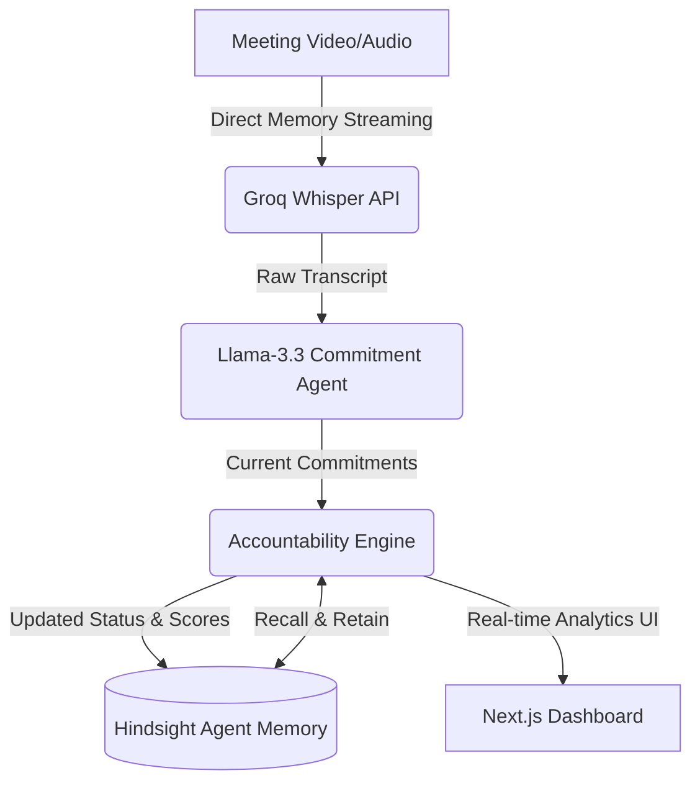

# How we designed an automated accountability scoring engine

Meetings are where software projects go to die. We’ve all been there: a critical decision is made, an engineer promises to deliver the updated API schema by Friday, and two weeks later, the team is still waiting. When asked, everyone has a slightly different recollection of what was committed, who was responsible, and when it was due. 

To solve this, we built a system that records team meetings, transcribes them, and extracts commitments automatically. But transcribing a meeting is the easy part. The real challenge is tracking these commitments *across time*. An action item extracted from Tuesday's sync needs to be reconciled against previous meetings, updated if the owner status changes, and flagged if it becomes overdue. 

To solve this persistent context problem, we integrated [Hindsight's agent memory](https://github.com/vectorize-io/hindsight), an open-source framework developed by Vectorize for managing [persistent agent memory](https://vectorize.io/what-is-agent-memory). By treating historical commitments as evolving agent memory, we designed an accountability scoring engine that tracks commitments, identifies repeating patterns of delays, and scores participant reliability. Here is how we built it.

---

## The Architecture of Meeting Intelligence

Our system is structured as a Next.js application backed by Firestore and Groq's LLM API. The pipeline runs in three sequential phases:

1. **Transcription & Extraction:** A meeting video or audio file is processed. We feed the raw media directly to Groq's Whisper API (`whisper-large-v3`) in-memory to get a transcript, bypassing the need for heavy local `ffmpeg` processing.
2. **Commitment Extraction:** The transcript is parsed by a low-temperature `llama-3.3-70b-versatile` model to extract a structured schema containing summary, sentiment, action items, risks, and commitments.
3. **Accountability Analysis:** This is where [Hindsight's persistent memory system](https://hindsight.vectorize.io/) comes in. We retrieve historical commitments from the database, compare them with the newly extracted data, and run an accountability evaluation to calculate reliability scores, detect overdue tasks, and map downstream escalation risks.



By decoupling commitment extraction from historical memory, we keep the prompts highly focused. Instead of stuffing every past meeting transcript into a massive context window, we query the Hindsight memory store to recall only active, relevant commitments for the participants in the current meeting.

---

## Bypassing ffmpeg and Going Direct to Memory

One of our first technical roadblocks was video ingestion. Meeting files are large, and typical transcription pipelines require downloading the video, running it through `ffmpeg` to extract the audio, and then chunking it. In a serverless environment like Next.js running on Vercel, this is a recipe for timeouts and ephemeral disk space issues.

We realized that Groq's Whisper endpoint natively accepts standard video formats like MP4 under a certain size limit. We optimized our API route to fetch the video file into an in-memory buffer, wrap it in a `Blob`, and send it directly to Groq. 

Here is the exact implementation of the Next.js API route that handles the download and transcription:

```typescript
// File: app/api/analyze-recording/route.ts

// 1. Download video directly into memory as a buffer
console.log('Downloading video...');
const videoResponse = await fetch(video_url);
if (!videoResponse.ok) throw new Error(`Failed to download: ${videoResponse.statusText}`);
const videoBuffer = await videoResponse.arrayBuffer();

// 2. Send the buffer directly to Groq Whisper for transcription (no ffmpeg needed)
console.log('Transcribing with Groq Whisper...');
const formData = new FormData();
formData.append(
  'file', 
  new Blob([new Uint8Array(videoBuffer)], { type: 'video/mp4' }), 
  'recording.mp4'
);
formData.append('model', 'whisper-large-v3');
formData.append('response_format', 'verbose_json');

const whisperResponse = await fetch('https://api.groq.com/openai/v1/audio/transcriptions', {
  method: 'POST',
  headers: {
    'Authorization': `Bearer ${GROQ_API_KEY}`,
  },
  body: formData,
});
```

By keeping the file in memory, we dramatically reduce I/O bottlenecks and simplify deployment. We only write to a temp file for short-lived debugging if needed, ensuring the system remains stateless and highly scalable.

---

## Designing the Accountability Engine

Extracting commitments is a pattern-matching task. Evaluating accountability, however, requires state management. A commitment has a lifecycle: it is proposed, assigned, tracked, delayed, completed, or neglected. 

To determine reliability, our accountability engine compares the current meeting's commitments with the historical memory recalled from Hindsight. We structured the LLM prompt to run a specific semantic reconciliation. The engine checks:
- If a historical commitment is mentioned as completed in the current transcript.
- If a commitment has passed its due date without a status update (making it "overdue").
- If the same person has repeated the same promise across multiple meetings without delivering (detecting repeated delay patterns).

Here is the core structure of our server action that orchestrates this analysis:

```typescript
// File: actions/ai.actions.ts

export const analyzeAccountability = async (
  meetingIntelligence: any,
  commitmentIntelligence: any,
  historicalCommitments: any[],
  currentDate: string
) => {
  const apiKey = getApiKey();
  const prompt = `
# AGENT 3 — ACCOUNTABILITY ENGINE
Your job is to analyze historical commitments and current commitments, and determine:
* Open commitments, Completed commitments, Overdue commitments
* Reliability scores (range 0-100) per participant
* Repeated commitment patterns and downstream escalation risks

## Inputs
* Meeting Intelligence: ${JSON.stringify(meetingIntelligence, null, 2)}
* Current Commitments: ${JSON.stringify(commitmentIntelligence, null, 2)}
* Historical Commitment Database: ${JSON.stringify(historicalCommitments, null, 2)}
* Current Date: ${currentDate}

Return ONLY valid JSON matching the requested schema. No markdown.
`;

  const response = await fetch(`https://api.groq.com/openai/v1/chat/completions`, {
    method: 'POST',
    headers: {
      'Content-Type': 'application/json',
      'Authorization': `Bearer ${apiKey}`
    },
    body: JSON.stringify({
      model: "llama-3.3-70b-versatile",
      messages: [
        {
          role: "system",
          content: "You are an enterprise-grade Accountability Intelligence Agent. Return ONLY valid JSON."
        },
        { role: "user", content: prompt }
      ],
      response_format: { type: "json_object" },
      temperature: 0.1
    }),
  });

  return JSON.parse((await response.json())?.choices?.[0]?.message?.content);
};
```

By combining a temperature of `0.1` and forcing Groq's JSON mode (`response_format: { type: "json_object" }`), we achieve highly deterministic updates. The engine calculates reliability scores using a transparent formula: completing commitments on time keeps the score high; letting them slip past the due date triggers penalty deductions based on the severity of the delay.

---

## Tracking Context and Running Meeting Briefings

Before entering a project meeting, a team lead wants answers to two questions: *Who owes us what?* and *What are the active risks?*

Using the consolidated memory in Hindsight, we created a briefing agent that runs *before* a meeting starts. It aggregates the project’s state and generates a strategy. If the database shows that a security review is consistently blocking the pipeline, the agent warns the user and suggests specific questions to ask the security owner.

```typescript
// File: actions/ai.actions.ts

export const prepareMeetingBriefing = async (
  meetingIntelligence: any,
  commitmentIntelligence: any,
  accountabilityIntelligence: any,
  contactHistory: any
) => {
  const prompt = `
# SYSTEM PROMPT — Meeting Preparation Agent
Prepare the user for an upcoming meeting using previous intelligence, accountability records, and relationship history.
Generate an executive brief, identify warnings (overdue commitments, repeated delays), and recommend an actionable meeting strategy.
`;
  // Fetch call to Groq Llama-3.3-70b with JSON formatting
  // ...
};
```

This briefing agent gives team leads a competitive advantage. Rather than reviewing hours of past recordings or searching through messy Slack history, the agent synthesizes the context and generates a 3-sentence executive summary paired with a list of critical questions to resolve.

---

## Results in Practice

When deployed, the system changes the dynamic of team syncs. A typical dashboard output from our database highlights the structured, objective insights generated by the model:

```json
{
  "reliability_scores": [
    {
      "person": "Dave (Backend Lead)",
      "total_commitments": 12,
      "completed": 10,
      "overdue": 1,
      "active": 1,
      "reliability_score": 88
    },
    {
      "person": "Sarah (QA Analyst)",
      "total_commitments": 8,
      "completed": 8,
      "overdue": 0,
      "active": 0,
      "reliability_score": 100
    }
  ],
  "repeated_patterns": [
    {
      "owner": "Dave (Backend Lead)",
      "pattern": "Promising API documentation updates that are consistently delayed",
      "occurrences": 3
    }
  ],
  "escalation_risks": [
    {
      "risk": "Integration testing block",
      "severity": "High",
      "caused_by": "API documentation is overdue by 14 days"
    }
  ],
  "accountability_insights": [
    "Sarah has resolved all QA commitments on time.",
    "Dave's delayed documentation updates are now blocking integration testing."
  ]
}
```

Instead of vague complaints about "communication issues," the team has concrete data. They can see that integration testing is blocked specifically because Dave's API documentation is 14 days overdue, allowing them to redirect resources or adjust deadlines objectively.

---

## Lessons Learned

Building this system taught us several critical lessons about working with LLMs, unstructured text, and agentic workflows:

1. **Avoid Vector Search for Structured Lifecycles:** When we started, we tried storing commitments in a standard vector database and using RAG (Retrieval-Augmented Generation) to search for them. It failed. Vector search is great for finding semantic similarity, but terrible for tracking status transitions (e.g., matching "I will deliver the API schema" in Meeting A with "I finished the schema yesterday" in Meeting B). Explicit, structured extraction with database-backed matching is far more reliable.
2. **Deterministic Schemas Require Low Temperature:** When prompting models for structured JSON, any temperature above `0.2` risks formatting errors or missing fields. Keep the temperature at `0.1` or lower and leverage JSON mode to ensure the output can be parsed safely.
3. **Use Memory Consolidations, Not Full Contexts:** Running transcripts of multiple meetings directly into an LLM's context window is expensive, slow, and hits rate limits quickly. Using a system like Hindsight to persistently store, recall, and reflect on condensed facts and relationships is the only viable path to scale.
4. **Bypass Local Transcoders Whenever Possible:** Relying on system-level binaries like `ffmpeg` in modern serverless runtimes adds configuration complexity and cold-start latency. By leveraging APIs that natively accept raw multimedia formats, we kept our cloud architecture simple, lightweight, and fast.
